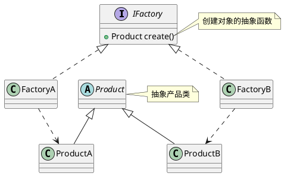
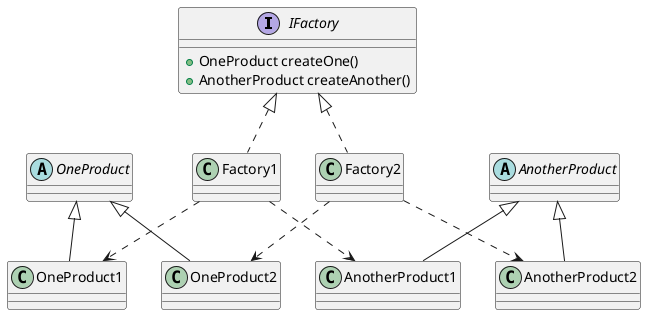

# 实验1 基础实验
## 1 实验目的
学会用UML设计类图，熟练掌握基于工厂方法、抽象工厂的设计思维。

## 2 实验环境
开发环境：JDK 8.0（或更高版本，高版本要下载独立JavaFX）
开发工具：Eclipse
设计工具：StarUML（或PlantUML）

## 3 基础知识
###  3.1 工厂方法模式
工厂方法模式中的角色包括工厂接口、具体工厂类、抽象产品类、具体产品类。类结构如下：


###  3.2 抽象工厂模式
工厂方法模式中的角色包括工厂接口、具体工厂类、抽象产品类、具体产品类。类结构如下：



## 4 实验内容
### 实验1 类图分析
>问题描述：销售公司（Company）根据订单购置一批轿车（Car），目前订单上只有A（CarA）和B（CarB）两种品牌的车辆。假设车辆主要由车架（Frame）、车轮（Wheel）和发动机（Engine）三个部件组成。（1）现用工厂方法设计程序，模拟订单处理流程，设计类图和完成代码实现；（2）任意添加一种品牌汽车，分析新程序与原程序之间得区别，从设计图和代码两方面分析（第2小问，只需分析，不需要设计类图和实现代码）。

客户端程序代码：
```java
public class Company{

	public static void main(String[] args){
    // 配置工厂信息
	Map<String, IFactory> factoryMap = new HashMap<String, IFactory>();
	factoryMap.put("A", new FactoryA());
	factoryMap.put("B", new FactoryB());
		
    // 车辆仓库
	List<Car> list = new ArrayList<Car>();
		
    // 输入订单，根据订单选择工厂进行生产
	try(Scanner input = new Scanner(new FileInputStream(new File("order.txt")))){
		while(input.hasNext()) {
			String typeToCreate = input.next();
			IFactory selectedFactory = factoryMap.get(typeToCreate);
			list.add(selectedFactory.createCar());
		}
	} catch(FileNotFoundException e){
		e.printStackTrace();
	}
		
    // 打印车辆信息
		for(Car c:list) {
			System.out.println(c);
		}
	}
}
```

### 实验2 角色动画
>问题描述：给出两张资源图片，实现两个阵营的建筑和士兵动画，士兵动画可以根据自己想法定义。效果图如下：
</img>

提示：采用抽象工厂模式进行设计，建筑和士兵分别看作两种类型的产品，阵营分为玩家阵营和电脑阵营，每个阵营的要素由统一的工厂生产。以下是没有采用工厂模式设计的程序，提供参考：
```java
public class MyApp extends Application {

	@Override
	public void start(Stage primaryStage) throws Exception {
		Group group = new Group();
		Scene scene = new Scene(group, 1200, 512);
		
		Canvas gameCanvas = new Canvas();
		GraphicsContext gc = gameCanvas.getGraphicsContext2D();
		gameCanvas.widthProperty().bind(scene.widthProperty());
		gameCanvas.heightProperty().bind(scene.heightProperty());
		
        group.getChildren().add(gameCanvas);
		primaryStage.setScene(scene);

		Image mapImage = new Image("file:" + 
		System.getProperty("user.dir") + "/bin/images/maps/map03.jpg");

		//创建建筑和士兵对象
		Image resource1 = new Image("file:" + 
		System.getProperty("user.dir") + "/bin/images/res/res01.png");
		Image resource2 = new Image("file:" + 
		System.getProperty("user.dir") + "/bin/images/res/res02.png");
		Image house1 = ImageTool.clipImage(resource1, 600, 0, 240, 256);
		Image house2 = ImageTool.clipImage(resource2, 0, 0, 240, 256);
		Building b1 = new PlayerBuilding(house1, new Point2D(0, 0));
		Building b2 = new PlayerBuilding(house2, new Point2D(944, 256));
		Image[] images1 = new Image[3];
		for(int i = 0; i < 3; i++) {
			images1[i] = ImageTool.clipImage(resource1, 540 + i * 110, 370, 110, 80);
		}
		PlayerRider ps = new PlayerRider(images1, new Point2D(200, 200));
		
		Image[] images2 = new Image[3];
		for(int i = 0; i < 3; i++) {
			images2[i] = ImageTool.rotate(
				ImageTool.clipImage(
					resource2, 10 + i * 100, 860, 100, 70), 180, new Point3D(0,1,0));
		}
		EnemyRider es = new EnemyRider(images2, new Point2D(800, 300));
		
		GameLoopTimer timer = new GameLoopTimer() {
			@Override
			public void inputProcess() {}
			
			@Override
			public void logicUpdate() {
				ps.move();
				es.move();
			}
			
			@Override
			public void displayUpdate() {
				gc.clearRect(0, 0, 1200, 512);
				gc.drawImage(mapImage, 0, 0);
				gc.drawImage(b1.getImage(), 
				b1.getPosition().getX(), b1.getPosition().getY());
				gc.drawImage(b2.getImage(), 
				b2.getPosition().getX(), b2.getPosition().getY());
				gc.drawImage(ps.getCurrentImage(), 
				ps.getPosition().getX(), ps.getPosition().getY());
				gc.drawImage(es.getCurrentImage(), 
				es.getPosition().getX(), es.getPosition().getY());
			}
			
        };
        
        timer.start();
        primaryStage.setResizable(false);
        primaryStage.show();
	}
	
	public static void main(String[] args) {
		launch(args);
	}

}
```
其他辅助类：
```java
// 游戏循环类
public abstract class GameLoopTimer extends AnimationTimer{
	private long startTime;
	private long nextTick;
	private final int TICKS_PER_SECOND = 10;  //定义每一帧的逻辑运算次数
	private final int SKIP_TICKS = 1000 / TICKS_PER_SECOND;
	private final int MAX_FRAMESKIP = 10;
	
	public GameLoopTimer() {
		super();
		startTime = System.currentTimeMillis();
		nextTick = 0L;
	}
	
	@Override
	public void handle(long now) {
		inputProcess();
		int loops = 0;
		while((System.currentTimeMillis() - startTime) > 
		nextTick && loops < MAX_FRAMESKIP) {
			logicUpdate();
			nextTick += SKIP_TICKS;
			loops++;
		}
		displayUpdate();
	}
	public abstract void inputProcess();
	public abstract void logicUpdate();
	public abstract void displayUpdate();
}

// 图片工具类，用于图片的处理
public class ImageTool {
	public static Image clipImage(Image sourceImage, int x, int y, int w, int h) {
		PixelReader pr = sourceImage.getPixelReader();
		WritableImage wi = new WritableImage(pr, x, y, w, h);
		return wi;
	}

	public static Image scale(Image source, int targetWidth, 
	int targetHeight, boolean preserveRatio) {
	    ImageView imageView = new ImageView(source);
	    imageView.setPreserveRatio(preserveRatio);
	    imageView.setFitWidth(targetWidth);
	    imageView.setFitHeight(targetHeight);
	    SnapshotParameters parameters = new SnapshotParameters();
	    parameters.setFill(Color.TRANSPARENT);
	    return imageView.snapshot(parameters, null);
	}
	
	public static Image rotate(Image source, double angle, Point3D axis) {
		ImageView imageView = new ImageView(source);
	    imageView.setFitWidth(source.getWidth());
	    imageView.setFitHeight(source.getHeight());
	    imageView.setRotate(angle);
	    imageView.setRotationAxis(axis);
		SnapshotParameters parameters = new SnapshotParameters();
		parameters.setFill(Color.TRANSPARENT);
		return imageView.snapshot(parameters, null); 
	}
}
```


## 5 实验要求
### 5.2 实验评价
1、完成实验内容（60%）
2、对实验思路进行阐述（20%）
3、对实验过程进行总结（20%）

### 5.1 实验报告
1、实验1完成程序和UML图设计，截取清晰的核心代码、设计图和效果到报告中；
2、实验2完成程序和UML图设计，截取清晰的核心代码、设计图和效果到报告中；
3、每个实验根据要求完成实验内容、思路阐述和总结。